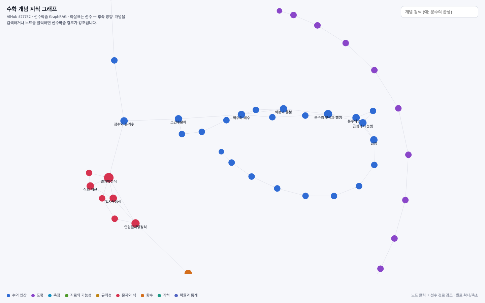
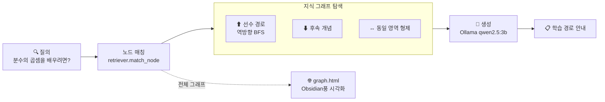

# 수학 개념 GraphRAG · 선수학습 지식 그래프 + Obsidian풍 시각화

> 초·중등 **수학 개념을 노드로, 선수학습(prerequisite) 관계를 엣지로** 하는 지식 그래프를 구축하고,
> 질의를 그래프에서 탐색해 **"이 개념을 배우려면 무엇을 먼저 익혀야 하는가"** 를 추적한 뒤
> 로컬 LLM이 학습 경로를 설명하는 **GraphRAG**입니다.
> 핵심 산출물은 **Obsidian 그래프뷰 풍 인터랙티브 시각화**(`graph.html`).
> AIHub **「수학분야 학습자 역량 측정」**([#27752](https://aihub.or.kr/aidata/27752), 구축기관: 아이스크림에듀) 교육과정 기반,
> **외부 pip 의존성 없이** 표준 라이브러리 + 로컬 Ollama만으로 동작합니다.

<p>
  
  
  
  
  
  
</p>

> 🔗 자매 프로젝트 [A005 · Hybrid RAG](https://github.com/byunkyusup/A005-math-item-hybrid-rag)는 **독립 문서를 BM25+임베딩으로 검색**합니다.
> 본 A006은 **개념 사이의 관계(그래프)** 를 검색한다는 점이 다릅니다 — 아래 비교 표 참고.

---

## 🎯 Hybrid RAG vs GraphRAG

| | Hybrid RAG (A005) | **GraphRAG (A006, 본 저장소)** |
|---|---|---|
| 검색 단위 | 독립 문서/청크 (문항 카드) | **관계로 연결된 개념 노드** |
| 검색 방식 | BM25(어휘) + 임베딩(의미) → RRF | 노드 매칭 → **그래프 탐색**(선수경로/후속/이웃) |
| 잘하는 질의 | "분수 곱셈 문항 추천" | **"분수 곱셈을 배우려면 뭘 먼저?"**, "이 학생 약점의 선수개념은?" |
| 산출물 | 검색 랭킹 + 추천 | **선수학습 경로 + Obsidian풍 그래프 시각화** |

---

## 🌐 핵심 산출물 — 인터랙티브 지식 그래프



> 위는 `graph.html`을 실제로 렌더링한 화면입니다(흰색 배경·영역별 색상 클러스터·선수관계 엣지·허브 개념 라벨).

`python -m src.viz` 로 자가완결 HTML을 만들고 브라우저에서 `graph.html` 을 엽니다. (`python -m src.viz dark` 로 다크 테마도 가능)

- **force-directed 그래프** (force-graph, canvas) — 라이트(기본)/다크 테마 지원, Obsidian 그래프뷰 느낌
- 노드 = 개념(84개), 색상 = **영역(9개)**, 크기 = 연결 차수
- 엣지 = 선수학습 관계, 화살표 **선수 → 후속**, 강조 시 입자 흐름
- **검색창**에 개념 입력 / 노드 클릭 → 해당 개념의 **선수학습 조상 경로를 금색으로 강조** + 나머지 디밍
- 노드 클릭 시 상세 패널(학년·영역·문항수·정답률·직속 선수/후속 개념)

> 외부 빌드 불필요 — `graph.html` 한 파일이면 됩니다(그래프 데이터 인라인, force-graph만 CDN).

---

## 🎬 실행 예시 — GraphRAG 질의

```console
$ python query.py "분수의 곱셈을 배우려면 무엇을 먼저 알아야 해?"

=== 목표 개념 ===
초5 분수의 곱셈 (영역: 수와 연산, 정답률 74%)

=== 선수학습 경로 (그래프 역탐색) ===
  -1단계 선수: 초5 분수의 덧셈과 뺄셈
  -2단계 선수: 초5 약분과 통분
  -3단계 선수: 초5 약수와 배수 · 초4 분수의 덧셈과 뺄셈
  -4단계 선수: 초5 자연수의 혼합 계산 · 초4 곱셈과 나눗셈 · 초3 분수와 소수

=== 후속 개념 ===
  초6 분수의 나눗셈

=== LLM 학습 경로 안내 (Ollama · qwen2.5:3b) ===
분수의 곱셈을 배우기 위해 필요한 선수학습 경로는 다음과 같습니다:
1단계: 먼저 분수와 소수, 자연수의 혼합 계산을 익혀야 합니다 …
2단계: 다음으로 약분과 통분을 배우세요 …
3단계: 마지막으로 분수의 덧셈과 뺄셈을 …
선수학습 경로에서 정답률이 낮은 부분이 있다면 이를 보강하는 것이 좋습니다.
```

> 그래프를 **역방향으로 BFS** 해 선수 개념을 레벨별로 모으고(`graph.ancestors_by_level`), 그 서브그래프를 컨텍스트로 LLM이 학습 순서를 설명합니다.

---

## 📐 아키텍처



| 모듈 | 역할 |
|------|------|
| `gen_graph.py` | 교육과정 → 개념 노드 + 선수학습 엣지(영역 계열 + 영역간 보강) + 통계 |
| `src/graph.py` | 그래프 자료구조 · 역방향 BFS(선수) · 후속 · 영역 멤버 |
| `src/retriever.py` | 질의 → 노드 매칭 → 컨텍스트 서브그래프 수집 |
| `src/generator.py` | 서브그래프 → 학습 경로 설명 프롬프트 |
| `src/viz.py` | graph.json → Obsidian풍 인터랙티브 HTML |
| `query.py` | GraphRAG 질의 CLI |

---

## 🚀 빠른 시작

```bash
ollama serve
ollama pull qwen2.5:3b           # 생성 모델

python3 gen_graph.py             # 지식 그래프 생성  → data/graph.json
python3 -m src.viz               # 시각화 빌드       → graph.html
open graph.html                  # 브라우저에서 그래프 탐색 (macOS)

python3 query.py "이차방정식을 풀려면 무엇을 먼저 알아야 해?"
python3 query.py --no-gen "삼각비"   # 그래프 경로만(생성 생략)
```

---

## 🗂️ 데이터 모델

- **노드(개념)**: `id`("학년:개념"), `label`, `grade`, `area`, `items`, `correctRate`, `keywords[]`, `val`(크기)
- **엣지(선수관계)**: `source`(선수 개념) → `target`(후속 개념)
- 84개 개념 · 92개 선수관계 · 9개 영역(수와 연산/도형/측정/규칙성/자료와 가능성/문자와 식/함수/기하/확률과 통계)

> 실 AIHub 데이터의 문항·학습자 응답을 붙이면, 학습자별 **약점 개념 → 선수 경로 보강 추천**으로 확장할 수 있습니다(학습자-문항 이분 그래프).

---

## ⚠️ 한계 / 참고

- 합성 데이터 기반(선수관계는 교육과정 계열 + 수작업 보강). 실데이터로 교체 시 `gen_graph.py`의 `CROSS_PREREQ`만 보강하면 됩니다.
- `qwen2.5:3b`는 경량 모델이라 정답률 수치 해석에 사소한 오차가 있을 수 있음 → 더 큰 모델(`qwen2.5:7b`)로 `src/config.py`에서 교체 가능.
